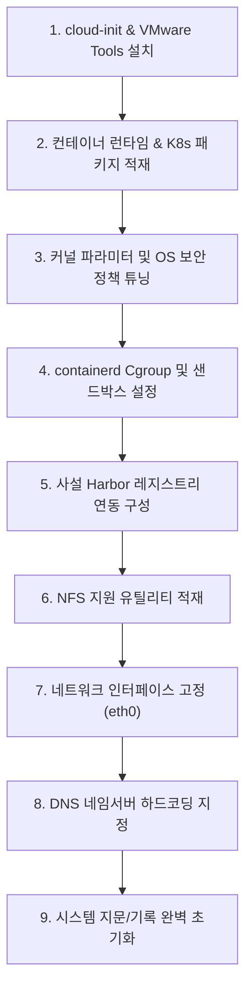

# ☸️ Rocky Linux 9 기반 Kubernetes Node VM 템플릿 제작 가이드

이 가이드는 Rocky Linux 9 환경에서 쿠버네티스(**Kubernetes v1.33.7**) 노드로 즉시 투입될 수 있는 표준 가상 머신(VM) 템플릿을 제작하기 위한 상세 빌드 지침서예요. 

컨테이너 런타임인 **containerd.io-2.1.\*** 환경과 하버 사설 레지스트리(**Harbor**) 연동용 구성, OS 커널 네트워크 최적화, 인터페이스 명칭 고정 및 배포 시 충돌 방지를 위한 청소 스크립트를 단계별로 철저히 다뤄요.

---

## 🧭 전체 빌드 절차 요약



---

## 🛠️ 단계별 상세 빌드 가이드

### 1단계. cloud-init & VMware Tools 적재 및 활성화
가상 하드웨어 연동 및 초기 네트워크 렌더링에 필요한 핵심 환경 변수와 패키지를 구성해요.

```bash
# 1.1 cloud-init 배포판 설치
sudo dnf install -y cloud-init

# 1.2 네트워크 렌더러를 NetworkManager로 제한 지정
sudo sh -c 'cat > /etc/cloud/cloud.cfg.d/99-network-renderer.cfg << EOF
system_info:
  network:
    renderers: ['network-manager']
EOF'

# 1.3 VMware 및 OVF 메타데이터 소스 연동 파일 구성
sudo sh -c 'cat <<EOF > /etc/cloud/cloud.cfg.d/99_vmware.cfg
datasource_list: [ VMware, OVF, None ]
datasource:
  VMware:
    allow_raw_data: true
    allow_update_network: true
    network_config:
      encoding: base64
      variable: network
EOF'

# 1.4 서비스 자동 가동 등록
sudo systemctl enable cloud-init

# 1.5 가상화 에이전트 open-vm-tools 기동
sudo dnf install -y open-vm-tools
sudo systemctl enable --now vmtoolsd
```

---

### 2단계. containerd & Kubernetes 패키지 리포지토리 구성 및 적재
쿠버네티스 컴포넌트(v1.33.7)와 컨테이너 엔진 패키지를 구성해요.

```bash
# 2.1 EPEL 추가 저장소 활성화 및 최신 상태 동기화
sudo dnf install -y epel-release
sudo dnf update -y 

# 2.2 사전 요구 유틸리티 설치
sudo dnf install -y socat conntrack-tools iproute-tc libseccomp curl tar jq chrony yum-utils

# 2.3 Docker CE 리포지토리 추가 (containerd.io 패키지용)
sudo dnf config-manager --add-repo https://download.docker.com/linux/centos/docker-ce.repo

# 2.4 Kubernetes 공식 RPM 저장소 구성 (v1.33 릴리스 트랙)
cat <<EOF | sudo tee /etc/yum.repos.d/kubernetes.repo
[kubernetes]
name=Kubernetes
baseurl=https://pkgs.k8s.io/core:/stable:/v1.33/rpm/
enabled=1
gpgcheck=1
gpgkey=https://pkgs.k8s.io/core:/stable:/v1.33/rpm/repodata/repomd.xml.key
exclude=kubelet kubeadm kubectl cri-tools kubernetes-cni
EOF

# 2.5 containerd.io 및 쿠버네티스 노드 3대 패키지 설치
# (의도치 않은 버전 업데이트 방지를 위해 DNF 기본 옵션에서 제외 처리)
sudo dnf install -y containerd.io-2.1.*
sudo dnf install -y --disableexcludes=kubernetes \
    kubelet-1.33.7-* kubeadm-1.33.7-* kubectl-1.33.7-*
```

---

### 3단계. K8s 운영용 OS 보안 정책 및 네트워킹 튜닝
쿠버네티스 오버레이 네트워크가 정상 동작할 수 있도록 방화벽 및 스왑 볼륨 차단 등의 시스템 개량을 단행해요.

```bash
# 3.1 SELinux 허용 모드로 즉시 하향 조절 및 부팅 설정 영구 수정
sudo setenforce 0
sudo sed -i 's/^SELINUX=enforcing$/SELINUX=permissive/' /etc/selinux/config

# 3.2 로컬 방화벽 비활성화 처리
sudo systemctl stop firewalld
sudo systemctl disable firewalld

# 3.3 오버레이 네트워킹 커널 모듈 활성화
sudo modprobe overlay
sudo modprobe br_netfilter

# 3.4 부팅 시 해당 모듈이 상시 자동 로드되도록 등록
cat <<EOF | sudo tee /etc/modules-load.d/k8s.conf
overlay
br_netfilter
EOF

# 3.5 브리지 및 포워딩 세부 커널 파라미터 셋업
cat <<EOF | sudo tee /etc/sysctl.d/k8s.conf
net.bridge.bridge-nf-call-iptables  = 1
net.bridge.bridge-nf-call-ip6tables = 1
net.ipv4.ip_forward                 = 1
EOF
sudo sysctl --system

# 3.6 메모리 스왑 디바이스 완전 중지 및 자동 마운트 테이블에서 원천 제거
sudo swapoff -a
sudo sed -i '/\sswap\s/s/^/#/' /etc/fstab

# 3.7 systemd 수준의 스왑 마스크 차단 조치
# swapoff 이후에도 systemd swap 유닛이 살아나 클러스터 구동을 망치는 문제 방지
sudo systemctl list-units --type=swap
sudo systemctl list-unit-files --type=swap

# 위 조회 결과에서 획득된 swap 유닛 식별자를 대입하여 하드 마스킹 수행
# 예: sudo systemctl mask dev-zram0.swap 등
sudo systemctl mask {스왑_출력값}

# 마스킹 확인 검증
sudo systemctl list-unit-files --type=swap
```

---

### 4단계. containerd 컨테이너 런타임 세부 셋업
systemd cgroup 드라이버 동기화 및 전용 스토리지 분리 구성을 진행해요.

```bash
# 4.1 기본 설정 디렉토리 마련 및 프로토콜 기본 설정 파일 덤프
sudo mkdir -p /etc/containerd
sudo containerd config default | sudo tee /etc/containerd/config.toml

# 4.2 SystemdCgroup 옵션을 true로 전환하여 K8s 드라이버 충돌 방지
sudo sed -i 's/SystemdCgroup = false/SystemdCgroup = true/' /etc/containerd/config.toml

# 4.3 K8s 샌드박스 일시정지 이미지(Pause Image) 표준 버전 v3.10 강제 지정
sudo sed -i 's|sandbox_image = ".*"|sandbox_image = "registry.k8s.io/pause:3.10"|' /etc/containerd/config.toml

# 4.4 컨테이너 레지스트리 보안 호스트 인증 경로 매핑 설정
sudo sed -i "s|config_path = '/etc/containerd/certs.d:/etc/docker/certs.d'|config_path = '/etc/containerd/certs.d'|g" /etc/containerd/config.toml
```

#### 💡 데이터 디스크가 물리적으로 분리되어 마운트되어 있을 경우 (권장)
> 컨테이너 빌드 및 적재 시 루트 파티션(`/`)의 가득 참(DiskPressure) 이슈를 피하기 위해 전용 볼륨으로 디렉토리를 심볼릭 링크 처리해요.

```bash
# 1. 데이터 파티션 내부로 타겟 디렉토리 적재 공간 확보
sudo mkdir -p /data001/containerd_data

# 2. 기본 경로를 해당 마운트 볼륨으로 연계 링크 구성
sudo ln -s /data001/containerd_data /var/lib/containerd

# 3. 링크 구성 상태 육안 검사
ls -ld /var/lib/containerd
# 정상 매핑 결과 예시: lrwxrwxrwx ... /var/lib/containerd -> /data001/containerd_data
```

```bash
# 4.5 containerd 엔진 활성화 기동
sudo systemctl enable --now containerd
sudo systemctl restart containerd

# 4.6 엔진 런타임 및 소켓 가동 상태 자가 점검
sudo ctr version
sudo crictl --runtime-endpoint=unix:///run/containerd/containerd.sock info | head -20

# 4.7 노드 매니저인 kubelet 프로세스 활성화
sudo systemctl enable --now kubelet
```

---

### 5단계. 사설 Harbor 레지스트리 도메인 연동 및 비인증 통과 구성
폐쇄망 및 사설 인프라 내 구축된 Harbor 레지스트리와 통신할 수 있도록 hosts 구성을 드롭인 설정해요.

```bash
# 5.1 사설 하버 인프라 레지스트리 IP 및 포트 정보 등록 (실제 IP와 포트로 대체)
HARBOR_HOST="<HARBOR_IP>:<PORT>"

# 5.2 전용 도메인 인증 정보 저장 홀더 개설
sudo mkdir -p /etc/containerd/certs.d/${HARBOR_HOST}

# 5.3 비인증(insecure-skip-verify) 포함 전용 통신 hosts 구성 덤프
sudo tee /etc/containerd/certs.d/${HARBOR_HOST}/hosts.toml <<EOF
server = "http://${HARBOR_HOST}"

[host."http://${HARBOR_HOST}"]
  capabilities = ["pull", "resolve", "push"]
  skip_verify = true
EOF
```

> [!IMPORTANT]
> 구성이 완료되면 반드시 `/etc/containerd/config.toml` 내부에 아래와 같이 인증 디렉토리 매핑 경로가 잘 수록되어 있는지 눈으로 확인해 주어야 해요.
> ```toml
> [plugins."io.containerd.cri.v1.images".registry]
>    config_path = '/etc/containerd/certs.d'
> ```
> 또한 4.3단계에서 조정한 `registry.k8s.io/pause:3.10` 부분도 폐쇄망 환경 사양에 맞춘다면 수동으로 위의 Harbor 내부 미러링 경로(`<HARBOR_IP>:<PORT>/k8s.io/pause:3.10` 등)로 대체 구성해 주는 조치도 유용해요.

```bash
# containerd 런타임 재기동하여 Harbor 구성 반영
sudo systemctl restart containerd
```

---

### 6단계. NFS 스토리지 연동 유틸리티 탑재
K8s 영구 볼륨 동적 매핑(NFS CSI Provisioner 등)이 커널 수준에서 바운딩될 수 있도록 NFS 유틸 패키지를 사전 적재해 주어요.

```bash
sudo dnf install -y nfs-utils
```

---

### 7단계. 네트워크 디바이스 명칭 고정 조치 (`eth0`)
인터페이스 카드 지문이 뒤틀리는 사태를 조율하기 위해 디바이스명을 `eth0`, `eth1` 등으로 못 박아 둬요.

```bash
# 7.1 grub 커널 옵션 파일 개방
sudo vi /etc/default/grub

# -> GRUB_CMDLINE_LINUX 파라미터가 담긴 해당 우측 따옴표 닫기 바로 직전에 
# net.ifnames=0 biosdevname=0 구문을 공백 한 칸 띄우고 수동 주입해요. 
# (기존 값이 있다면 지우지 말고 덧붙임 방식 준수)

# 7.2 커널 유틸을 통하여 런타임 갱신 기동
grubby --update-kernel=ALL --args="net.ifnames=0 biosdevname=0"

# 7.3 UEFI 사양 디바이스 Grub 갱신 빌드
sudo grub2-mkconfig -o /boot/efi/EFI/rocky/grub.cfg

# 7.4 서버 재부팅 조치하여 검증 실행
reboot

# 재구동 후 바인딩 결과 조사
ip addr show
# (이름이 eth0 등으로 깔끔하게 변환되었는지 검사)
```

---

### 8단계. 폐쇄망 타겟 도메인 해석을 위한 DNS 네임서버 지정
OS가 인터넷 및 내부 사설망 DNS 질의에 한 치의 오류도 없도록 2개의 고정 네임서버 지문을 하드 코딩해요.

```bash
vi /etc/resolv.conf

# 아래 도메인 확인 정보 추가 (실제 사내 DNS 주소로 대체)
nameserver <DNS_IP_1>
nameserver <DNS_IP_2>
```

---

### 9단계. 시스템 초기화 및 템플릿 잠금 쉘스크립트 기동
VM이 신규 프로비저닝될 때 IP 중복 충돌, cloud-init 오동작 및 로컬 캐시 찌꺼기가 남지 않게 깔끔히 지우고 서버를 셧다운해요.

```bash
# 9.1 NetworkManager 유동 IP 연결 지문 말소
sudo rm -f /etc/NetworkManager/system-connections/*.nmconnection

# 9.2 기존 충돌 방지를 위한 netplan 경로 디렉토리 초기화
sudo rm -f /etc/netplan/*
sudo systemctl restart NetworkManager

# 9.3 cloud-init 히스토리 로그 및 잔재 캐시 완전 청소
sudo cloud-init clean --logs
sudo rm -rf /var/lib/cloud/*

# 9.4 고유 장치 machine-id 지문 리셋
sudo truncate -s 0 /etc/machine-id
sudo rm -f /var/lib/dbus/machine-id

# 9.5 중복 네트워크 디바이스 설정 추가 삭제
sudo rm -f /etc/NetworkManager/system-connections/*.nmconnection

# 9.6 저널로그 캐시 공간 제로화
sudo journalctl --vacuum-time=0

# 9.7 임시 디렉토리 클리어
sudo rm -rf /tmp/*

# 9.8 쉘 명령어 실행 히스토리 파일 원천 포맷
history -c && history -w

# 9.9 시스템 전원 오프
sudo poweroff
```

가상 머신의 전원이 나간 후, vCenter에서 해당 가상 머신을 **템플릿으로 변환** 처리하면 노드 전용 이미지 배포 준비가 완전히 완료돼요!
